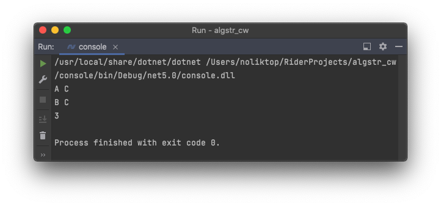

## algstr_cw

Курсовая работа по предмету "Алгоритмы и структуры данных".

Реализован [алгоритм Краскала](https://github.com/NolikTop/algstr_cw/blob/master/src/KruskalAlgorithm.cs) для поиска минимального остова, а также [алгоритмы обхода графа DFS и BFS](https://github.com/NolikTop/algstr_cw/blob/master/src/Traversal.cs). 

Обратите внимание, что файл [input.txt](https://github.com/NolikTop/algstr_cw/blob/master/input.txt) копируется при билде в папку с скомпилированным проектом 
(при компиляции [console](https://github.com/NolikTop/algstr_cw/tree/master/console)).

Если вы планируете скомпилировать проект только 1 раз, а в дальнейшем лишь менять input.txt, 
или по какой то причине при изменении содержимого input.txt ответ не будет меняться, укажите путь до
[файла с вводными данными (input.txt)](https://github.com/NolikTop/algstr_cw/blob/master/input.txt) в коде 
[в переменной path](https://github.com/NolikTop/algstr_cw/blob/master/console/Program.cs#L15). 

Результат работы программы выводится исключительно в консоль. 
